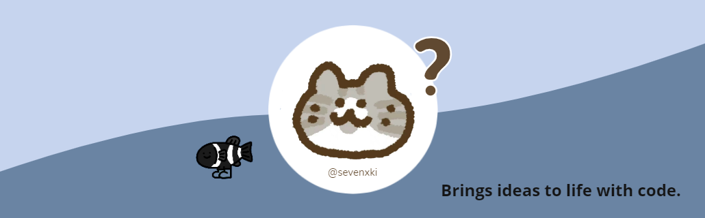

## Hello there 👋
<!--  -->

<!-- visitor volume -->

  

<!-- header -->

<!-- My Tag -->

  

<!-- detail -->

  
 For more information

#### About me

* 🎓 I am a student at SCAU. 
* 🎯 Aspire to become an excellent Frontend Developer.
* 🌱 Currently learning Web development, NLP & English.
* 📖 Ongoing knowledge output at [sevenkiki.com](https://www.cnblogs.com/sevenkiki/) or [sevenxki.com](https://www.yuque.com/sevenxki).
* 💗 Pursue all beautiful and interesting things.

<!-- #### Coding statistics
 -->

#### Connect with me

&nbsp;&nbsp;

&nbsp;&nbsp;

&nbsp;&nbsp;

#### Languages and Tools

